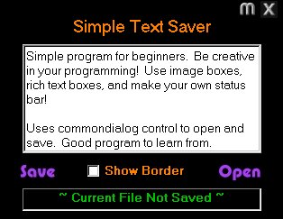



## SimpleText

### Description

*For Beginners* A simple "word processor" that shows you how to use commondialog to open and save rich text box files. Uses image boxes as buttons, including the "X" button and "M" (minimize) button.
 
### More Info
 

             |
---                |---
**Submitted On**   |2000-08-05 17:52:00
**By**             |[N/A](https://github.com/Planet-Source-Code/PSCIndex/blob/master/ByAuthor/empty.md)
**Level**          |Beginner
**User Rating**    |4.0 (12 globes from 3 users)
**Compatibility**  |VB 4\.0 \(32\-bit\), VB 5\.0, VB 6\.0
**Category**       |[Miscellaneous](https://github.com/Planet-Source-Code/PSCIndex/blob/master/ByCategory/miscellaneous__1-1.md)
**World**          |[Visual Basic](https://github.com/Planet-Source-Code/PSCIndex/blob/master/ByWorld/visual-basic.md)
**Archive File**   |[CODE\_UPLOAD8641852000\.zip](https://github.com/Planet-Source-Code/simpletext__1-10428/archive/master.zip)

